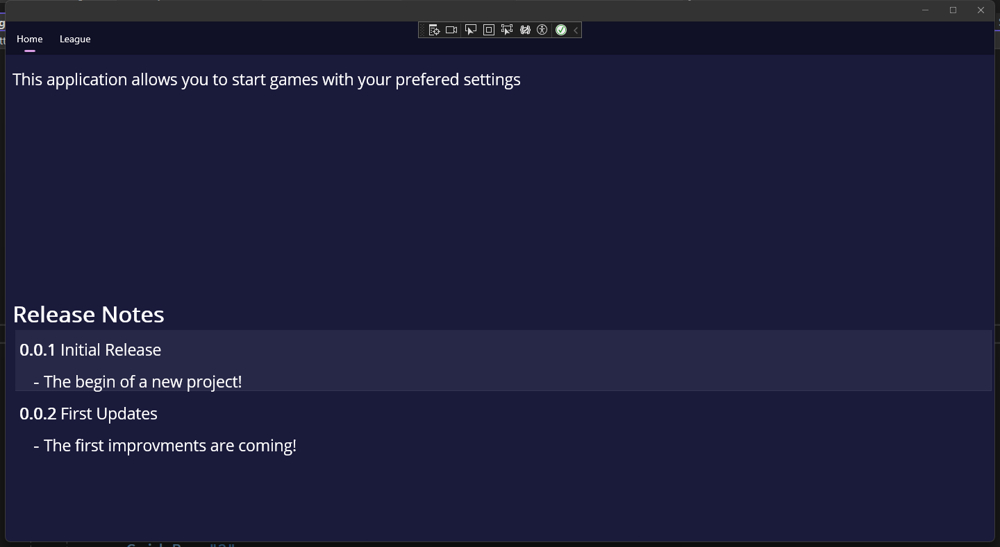
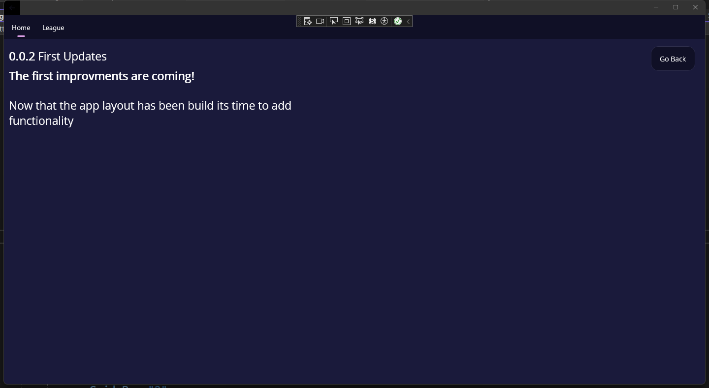
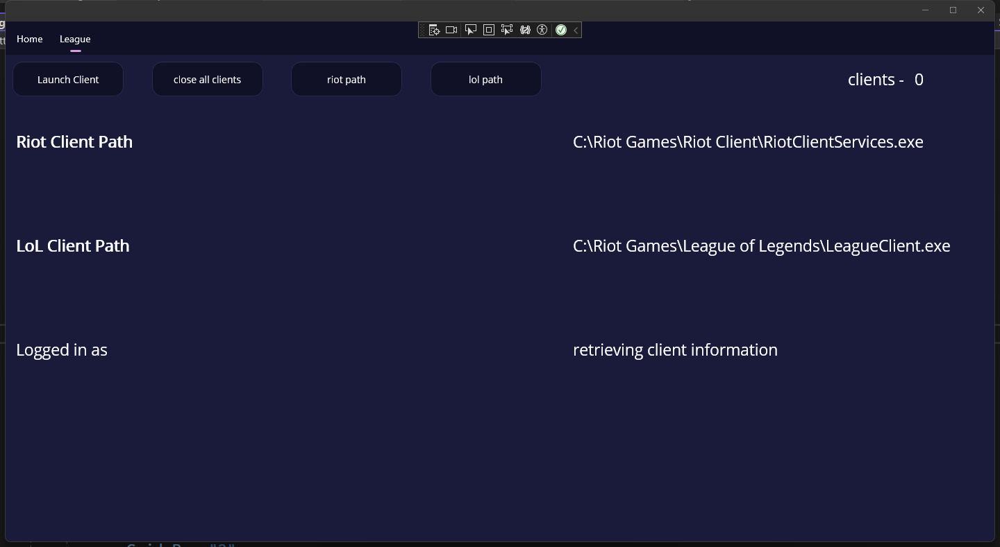

# **Eloinflater - Backend**

A desktop application written in c# using .net 7 and [MAUI](https://dotnet.microsoft.com/en-us/apps/maui).

This application allows you to launch multiple League of Legends Clients at the same time. You will also be able to modify Game-Settings for League of Legends.

## Table of Contents

- [Getting started](#Getting-started)
  - [Git](#Git)
  - [Debugging](#Debugging)
  - [GUI](#GUI)

## Git

In order to run the frontend locally you will need to clone the repository:

`git clone https://github.com/SandroSpengler/EloInflaterFrontend.git`

## Debugging

The project was written using [Visual Studio]("https://visualstudio.microsoft.com/"). After importing the Project into Visual Studio you can debug on the Windows Platform.

## GUI

